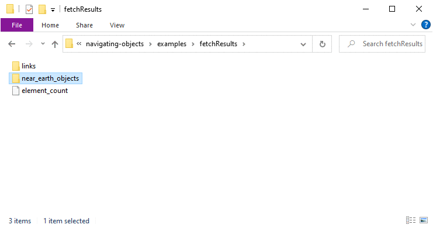

# Navigating Complex Objects

When you're just starting off in coding, the concept of nested objects and accessing their properties can be difficult to grasp. Seeing a complicated object with multiple levels of depth can be intimidating at first, but working with these kinds of objects is an important skill to develop. When retrieving information from databases and APIs, the results are often packaged in a **JSON *(JavaScript Object Notation)*** object that has many levels of nested objects. Understanding how to navigate these objects will be crucial when working with this kind of data. This post is written for those who are new to working with objects and are looking for a breakdown on how to access a property multiple layers deep in nested objects.

## The Sample Data

For the purpose of the examples here, we'll be looking at some real world *(and beyond)* data provided by NASA. There are a number of free APIs from NASA that are available for anyone to access, so this will be a good example of what a complex object could look like in a real application. Our sample data will be fetched from the [Asteroids - NeoWs](https://api.nasa.gov/#asteroids-neows) API which provides information about near-Earth asteroids. Below I have included a simplified *JSON schema* of the dataset that shows the organizational structure without the actual data. 

```json
// Simplified JSON schema for fetchResults
{
  "links": {},
  "element_count": 0,
  "near_earth_objects": {
    "yyyy-mm-dd": [
      {
        "links": {},
        "id": "",
        "neo_reference_id": "",
        "name": "",
        "nasa_jpl_url": "",
        "absolute_magnitude_h": 0,
        "estimated_diameter": {},
        "is_potentially_hazardous_asteroid": true,
        "close_approach_data": [],
        "is_sentry_object": true
      }
    ]
  }
}
```

**A couple of things to note**:
- There could be any number of key/value pairs under `near_earth_objects`, depending on how many days of data is requested through the API.
- The values associated with each date key are arrays, and these arrays can also contain any number of items.

If you are interested in seeing the actual JSON object, [here is the sample data](./sample-data.json) that I fetched with the API. The examples below will assume that a variable `fetchResults` has already been declared and that these results have already been assigned to it. There are two dates included in the results: `2015-09-07` (with 13 objects), and `2015-09-08` (with 11 objects).


## Accessing the Data

Let's say we wanted to read the `is_potentially_hazardous_asteroid` property of the first element associated with the date `"2015-09-07"`. How do we go about doing it? Well we have to navigate down through each level in the object, working our way through the nested objects to find the specific property we're trying to reach. Here's how you can do it in JavaScript:

```jsx
// JavaScript
//           ┌ access the 'near_earth_objects' object
//           │                 ┌ access the array associated with the desired date
//           │                 │             ┌ acccess the first object in the array
//           │                 │             │   ┌ access the desired property
fetchResults.near_earth_objects['2015-09-07'][0].is_potentially_hazardous_asteroid;
// => false
```

All right! So we got the property we were looking for and it returns a value of `false`, but how does this all work? Let's break this down:
1. `fetchResults` is the object returned from the API request as described above.
1. `.near_earth_objects` accesses the object that contains all the dates.
1. `['2015-09-07']` accesses the array of objects for the desired date. Note that **bracket notation is required** here for two reasons:
    - The key starts with a number.
    - The key contains a hyphen.
1. `[0]` accesses the first object of the array. **Bracket notation is required** here since we are retrieving an element inside an **array** instead of a property in an object.
1. `.is_potentially_hazardous_asteroid` finally gets us to the property we wanted to retrieve.

**Why can't we just do the following?**

```jsx
// JavaScript
fetchResults.is_potentially_hazardous_asteroid;
// => undefined
```

Well the `fetchResults` object only has three keys: `links`, `element_count`, and `near_earth_objects`. Accessing any other key will return `undefined`. The property we're trying to get to is four levels deep in the `fetchResults` object, so we have to use [property accessors](https://developer.mozilla.org/en-US/docs/Web/JavaScript/Reference/Operators/Property_accessors) four times in order to get to it. An object does not have immediate access to any of the keys in any children objects. 

*Side note*: Accessing this property can also be done purely with **bracket notation** as shown below, however I prefer using **dot notation** where possible for its readability.

```jsx
// JavaScript
fetchResults['near_earth_objects']['2015-09-07'][0]['is_potentially_hazardous_asteroid'];
// => false
```

## Visualizing the Data

When you're first learning about objects, accessing these nested properties can seem abstract and might be a hard concept to grasp. Another way to visualize this may be to **imagine this object as a folder tree** on your computer. When you want to access a file, you sometimes have to navigate through *multiple levels of directories* first. For each level of arrays/objects nested within the main object, imagine another subfolder with its own contents. When you're in the top level directory, you don't have immediate access to files in any of the sub-directories. 

For the purpose of demonstration, I have created a *mockup set of folders* to mirror the structure of the `fetchResults` object. Below is the output of running the `tree` command in the terminal for these directories. 
```bash
# bash
$ tree fetchResults
fetchResults
├── element_count
├── links
│   ├── next
│   ├── prev
│   └── self
└── near_earth_objects
    ├── 2015-09-07
    │   ├── 0
    │   │   ├── absolute_magnitude_h
    │   │   ├── close_approach_data
    │   │   │   ├── close_approach_date
    │   │   │   ├── close_approach_date_full
    │   │   │   ├── epoch_date_close_approach
    │   │   │   ├── miss_distance
    │   │   │   │   ├── astronomical
    │   │   │   │   ├── kilometers
    │   │   │   │   ├── lunar
    │   │   │   │   └── miles
    │   │   │   ├── orbiting_body
    │   │   │   └── relative_velocity
    │   │   │       ├── kilometers_per_hour
    │   │   │       ├── kilometers_per_second
    │   │   │       └── miles_per_hour
    │   │   ├── estimated_diameter
    │   │   │   ├── feet
    │   │   │   │   ├── estimated_diameter_max
    │   │   │   │   └── estimated_diameter_min
    │   │   │   ├── kilometers
    │   │   │   │   ├── estimated_diameter_max
    │   │   │   │   └── estimated_diameter_min
    │   │   │   ├── meters
    │   │   │   │   ├── estimated_diameter_max
    │   │   │   │   └── estimated_diameter_min
    │   │   │   └── miles
    │   │   │       ├── estimated_diameter_max
    │   │   │       └── estimated_diameter_min
    │   │   ├── id
    │   │   ├── is_potentially_hazardous_asteroid
    │   │   ├── is_sentry_object
    │   │   ├── links
    │   │   │   └── self
    │   │   ├── name
    │   │   ├── nasa_jpl_url
    │   │   └── neo_reference_id
    │   └── ...
    └── ...
```

See how the structure here is nearly identical to the structure of the object? The process of retrieving a file in this folder structure is very similar to that of retrieving a property in the object. In JavaScript you use dot and/or bracket notation to access a property of an object. In Bash or your file explorer you use `/` to access a subfolder.

```jsx
// JavaScript
// accessing a property in a series of nested objects
fetchResults.near_earth_objects['2015-09-07'][0].is_potentially_hazardous_asteroid;
```

```bash
# bash
# accessing a file in series of nested folders
fetchResults/near_earth_objects/2015-09-07/0/is_potentially_hazardous_asteroid
```

For a more visual example see below for an example of navigating through the mockup folder set up to match the structure of `fetchResults`. When you're trying to access a property that is multiple levels deep in an object, imagine that you are navigating a folder structure to get to the information you're looking for.



## Wrapping Up

Hopefully this brief explanation provides some clarity into navigating through nested objects! It may be intimidating at first, but it's an important skill to develop. **Objects with this level of complexity are common** and they can be structured in countless different ways. When you get data from an API, you may not have much (or any) control on how the data is formatted as you receive it. Being familiar with how to access the different properties will be a big help as you start to work with complex datasets. *Thanks for reading!*