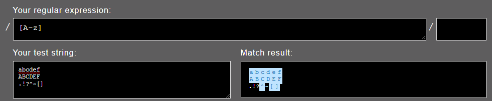

A while back I remember coming across one example online for finding a case-insensitive letter that looked like this:

```rb
/[A-z]/
```

> Just to make sure it's crystal clear, that's a range from uppercase `A` to lowercase `z`.

I thought this would be a great and concise way to do the job, but I came to realize it was not quite doing what I thought it would.

## The Issue With `/[A-z]/`

While I initially thought this would be fine, I was getting some unexpected results when I used it. Here's a screenshot from [Rubular](https://rubular.com/) showing what I started seeing:



The expression is successfully finding lowercase and uppercase letters, but it's also grabbing a few extra symbols. Where is this coming from?

Well if we take a look at the [ASCII table](https://www.ascii-code.com/), we'll notice that the uppercase alphabetical letters are codes 65 through 90, and that the lowercase alphabetical letters are codes 97 through 122. **There are six additional characters between the two sets of letters!** Below is a portion of the table showing the six characters and their decimal codes:

| Character Code | Character |
:-----: | :-----:
| ... | ... |
| 88 | `X` |
| 89 | `Y` |
| 90 | `Z` |
| **91** | **`[`** |
| **92** | **`\`** |
| **93** | **`]`** |
| **94** | **`^`** |
| **95** | **`_`** |
| **96** | **`` ` ``** |
| 97 | `a` |
| 98 | `b` |
| 99 | `c` |
| ... | ... |

Because of these additional symbols, what I thought was shorthand was a *completely different expression*.

This expression:

```rb
/[A-z]/
```

Really evaluates to be something more like:

```rb
/[A-Z\[\\\]^_`a-z]/
```

Now it's much clearer why the expression wasn't working the way I intended it to!

## What To Use Instead

If the **whole regex** can be case-insensitive, the easiest thing to do is use the case insensitive modifier, `i`:

```rb
/[a-z]/i
```

If only a **certain part** of your expression can be case-insensitive, there are a couple of options. For example, let's say we are looking for a three-character, letter-only string where the first and last character are lowercase but the middle character can be uppercase or lowercase. How would we write that?

One option would be to do this:

```rb
/[a-z][a-zA-Z][a-z]/
```

Another way to do this would be to [specify modes inline](https://www.regular-expressions.info/modifiers.html) with the expression. This allows you to turn on the case insensitive mode for a portion of your rexpression. Here's what that could look like:

```rb
/[a-z](?i)[a-z](?-i)[a-z]/
```

> Note: Specifying these modes inline may not work for all programming languages.

## Wrapping Up

I'm actually glad I came across this issue. It was a great learning experience and it was helpful to see how the ranges in regex work. I thought it would be good to share this here in case anyone else comes across this in the future. Hopefully this is helpful to someone! 

*Thanks for reading!*